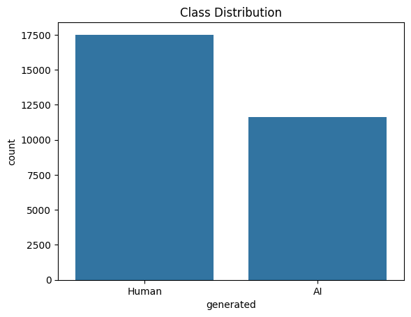
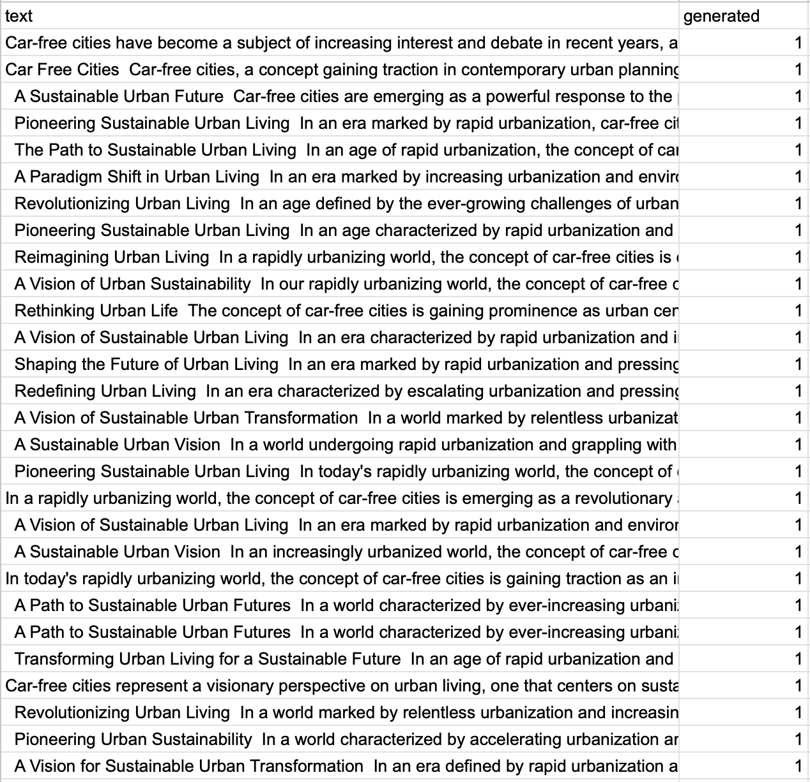
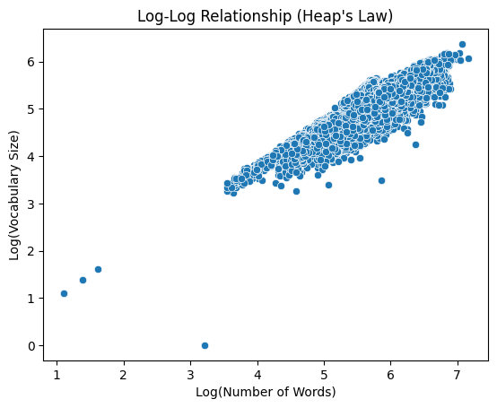
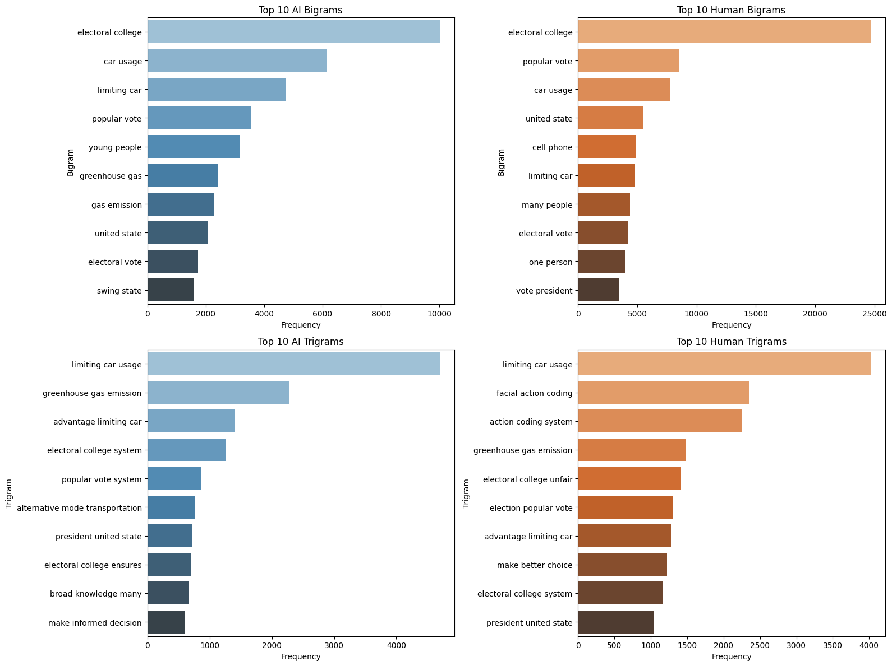
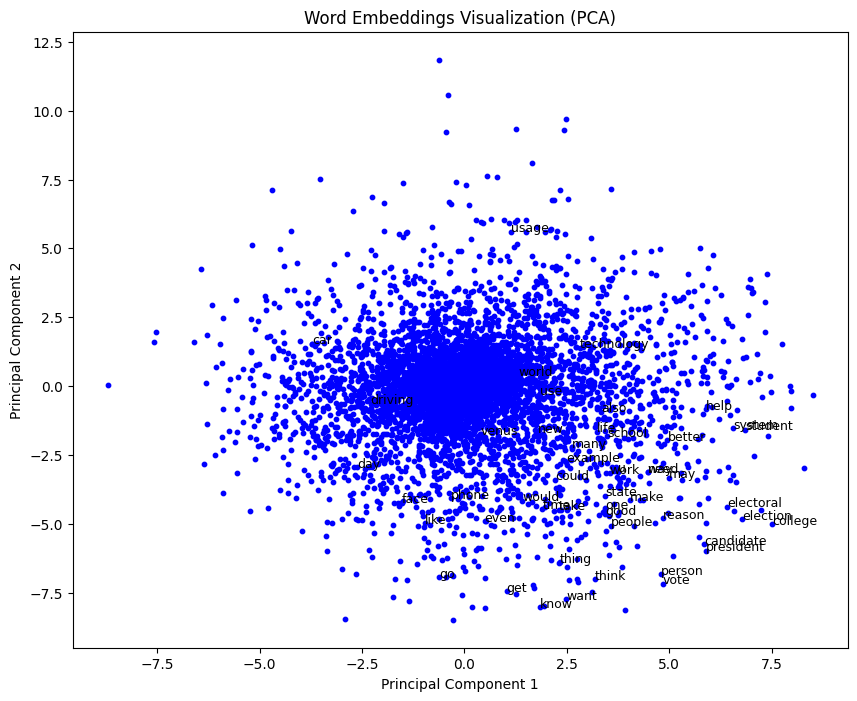
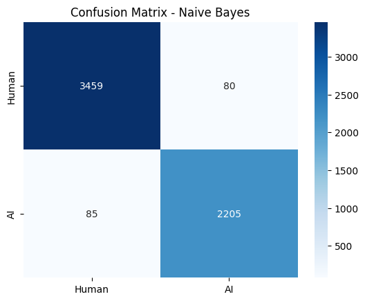
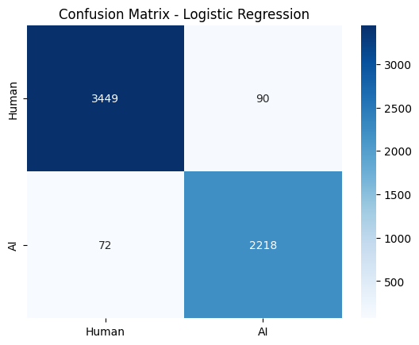
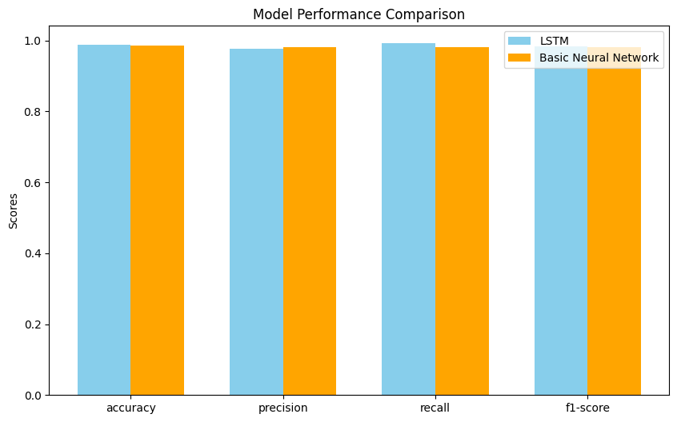
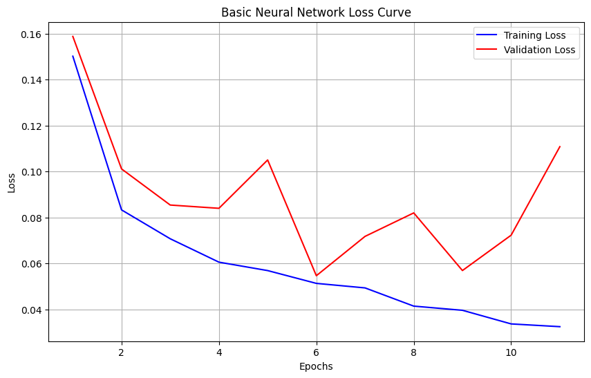
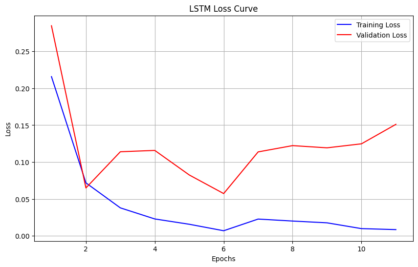

# Introduction
With the rise of AI-generated content across various domains, identifying the origin of text is increasingly important for ensuring transparency, credibility, and authenticity in media, education, and digital communication. 

In this project, we employ natural language processing (NLP) techniques to develop a machine learning model capable of classifying text as either AI-generated or human-written. 

By analyzing linguistic patterns and textual features characteristic of AI and human authorship, our goal is to create a reliable predictive model that can distinguish between the two.

# Dataset Description

The dataset used in this project is the "Training_Essay_Data" dataset, sourced from [**Kaggle**](https://www.kaggle.com/datasets/sunilthite/llm-detect-ai-generated-text-dataset), comprising both AI-generated and human-written texts for binary classification and natural language processing tasks. This data was compiled from student-written essays and essays generated by a variety of Large Language Models (LLMs), providing a reliable dataset for distinguishing human-written from AI-generated content.

This dataset includes approximately 29,000 entries, all of which are written in English about a variety of topics. 

The rows contain text data, with a binary label indicating the source of generation (1 for AI-generated, 0 for human-written). 

This label distribution shows that about **40%** of the entries are AI-generated, and the remaining **60%** are human-written, providing a dataset that is generally balanced but slightly skewed towards human-written content.



Variables in the dataset:

- `text`: Each row contains an essay or text entry, totaling **27,340 unique entries.**
- `generated`: A binary label where **"1" signifies AI-generated text, and "0" represents human-written text.**

This dataset is formatted as a CSV file with a total size of 65.46 MB, suitable for large-scale natural language processing and machine learning applications.



## Datasheet

**Motivation**: Created to facilitate the detection of AI-generated text in academic and professional domains.

**Situation**: Texts include essays from educational contexts and outputs from LLMs under various prompts.

**Language Variety**: Primarily English, encompassing formal and semi-formal styles.

**Speaker Demographics**: Student authors and AI systems with diverse prompt configurations.

**Collection Process**: Data was ethically sourced and de-identified to ensure privacy. Metadata includes text and origin labels.

**Annotation Process**: The labels were programmatically assigned (AI vs. human) based on source.

**Distribution**: Free for academic and non-commercial use under the specified license.


# Project Goals

Our objective is to create a robust classifier capable of accurately distinguishing between AI-generated and human-written text. This model can potentially be used in:
- Academic integrity tools
- Content moderation systems
- Journalism and media transparency


# Process Overview

The project followed a systematic, iterative approach consisting of the following key phases:

1. **Dataset Exploration and Analysis**: We began with a comprehensive exploration of the dataset to understand its structure, distribution, and key characteristics. This included analyzing word counts, vocabulary size distributions, and identifying trends like the adherence to Heap's Law.

2. **Data Preprocessing and Embedding Creation**: Text data was normalized using tokenization, lemmatization, and stop word removal. We generated document-level embeddings using Word2Vec to capture semantic meanings and employed these embeddings as feature inputs for some of our models. Additionally, TF-IDF vectors were used for models that better handle sparse, discrete data representations.

3. **Model Development and Evaluation**: Four models were implemented: Naive Bayes, Logistic Regression, a Basic Neural Network, and an LSTM. We systematically evaluated each model using classification metrics such as precision, recall, and F1-score. To address the slight class imbalance, undersampling of the majority class (human-generated essays) was applied to the training data.

4. **Performance Optimization**: We employed techniques such as early stopping during model training to prevent overfitting. Each model's hyperparameters and configurations were refined iteratively based on validation metrics.

5. **Comparative Analysis and Final Selection**: The models were compared based on evaluation metrics, confusion matrices, and overall interpretability. This step identified the best-performing model for the binary classification task.

This structured process ensured a thorough exploration of the problem space and enabled informed decision-making at each stage of the project.


# EDA & Preprocessing 

Our input was the text data of the raw essays, and our target variables were the generated binary label for the purpose of Binary Classification.

Before normalizing the text, we wanted to understand the dataset a bit more, so we found the word count and vocab size distributions to see if our data would fit with Heap's Law. As you can see in the figure below, it's not a perfectly linear relationship but its pretty close.



### Text Normalization
The next step in our process was to normalize our text. We decided to use a lemmatizer so as to keep the meaning of the words to later provide context,and remove stop words for clarity. Then we tokenized the text into sentences. The functions we used to do this are below.

```{python}
def normalize_text(text):
    tokens = word_tokenize(text)
    stop_words = set(stopwords.words('english'))
    tokens = [word.lower() for word in tokens if word.isalpha() and word.lower() not in stop_words]
    tokens = [lemmatizer.lemmatize(word) for word in tokens]
    normalized_text = ' '.join(tokens)
    return normalized_text

def segment_sentences(text):
    sentences = sent_tokenize(text)
    return sentences
```

### N-Grams
The next thing we wanted to see were the different bigrams and trigrams between human and ai generated text. The Top 10 most common ones are shown in the figure below:



Most of the n-grams overlap between the two text types, but AI-generated text tends to use slightly more formal language. These also let me make the assumption that most of these essays are about the American government in some capacity, since most of the top n-grams have to do with voting or some other issues currently being discussed in a political setting.

### Embeddings
After tokenizing the text, we generated word embeddings using `Word2Vec` and identified the Top 10 words most similar to __*ai*__ and __*human*__. 

#### Top 10 Similar to "ai"
| Keyword        | Score      |
|----------------|------------|
| intelligence   | 0.717855  |
| sophisticated  | 0.656383  |
| robotic        | 0.653765  |
| automation     | 0.653423  |
| robotics       | 0.633817  |
| iot            | 0.627065  |
| artificial     | 0.615188  |
| sensor         | 0.579249  |
| predictive     | 0.576298  |
| computing      | 0.566514  |

The results emphasize __*ai*__'s strong connection to advanced concepts like automation, robotics, and predictive computing.

#### Top 10 Similar to "human"
| Word           | Score               |
|----------------|---------------------|
| sentient       | 0.5894              |
| machine        | 0.4579              |
| intelligent    | 0.4426              |
| planet         | 0.4406              |
| extraterrestrial | 0.4394            |
| bottomless     | 0.4199              |
| scientist      | 0.4177              |
| brain          | 0.4063              |
| organism       | 0.3891              |
| vinchi         | 0.3882              |

The results highlight __*human*__'s association with themes of intelligence, advanced life forms, and exploration, suggesting a deep link to concepts of consciousness and complexity.

We then wanted to visualize these embeddings so we decided to use Principal Component Analysis (PCA) to help us do that, which can be seen in the figure below.



We generated document-level vector representations by averaging `Word2Vec` embeddings for the tokens in each document. This approach captures the semantic meaning of the text, creating a feature matrix where each row represents a document as a vector in embedding space. These vectors were then used as input features for some of our training and evaluation models for our classification task.

# Model Selection & Fitting

We decided to try out four different models, Naive Bayes, Logistic Regression, a Basic Neural Network, and an LSTM model. Since our dataset was slightly imbalanced, we decided to undersample the majority class (human generated). This balancing of the dataset occured for each model after the train-test split was created in order to ensure the test data was left untouched, so as to not create any bias.

### Naive Bayes
We used TF-IDF vectors as input features for the Naive Bayes model, because it is better suited for discrete and sparse representations. While `Word2Vec` embeddings can technically be used, they produce dense, continuous vectors that do not align well with the Naive Bayes assumption of feature independence. TF-IDF, with its interpretable and probabilistic nature, ensures better compatibility and performance for this model.

First, we transformed the `normalized_text` column into a sparse matrix of TF-IDF features using `TfidfVectorizer`, limiting the number of features to 5000 for manageability. The data is then split into training and test sets, with the undersampling step applied to balance the classes. We train a `MultinomialNB` model on the balanced training data, fit it to the training set, and evaluate its performance on the test set.

```{python}
X_train, X_test, y_train, y_test = train_test_split(data['normalized_text'], y, test_size=0.2, random_state=42)

tfidf = TfidfVectorizer(max_features=5000)
X_train_tfidf = tfidf.fit_transform(X_train)
X_test_tfidf = tfidf.transform(X_test)

undersampler = RandomUnderSampler(random_state=42)
X_train_balanced, y_train_balanced = undersampler.fit_resample(X_train_tfidf, y_train)

nb_model = MultinomialNB()
nb_model.fit(X_train_balanced, y_train_balanced)
```

### Logistic Regression
Our Logistic Regression model uses document vectors generated from `Word2Vec` embeddings as input features. We first split the data into training and test sets and apply undersampling to balance the classes. The balanced training data is used to fit the logistic regression model, which is trained with a maximum of 500 iterations to ensure convergence. The model's performance is then evaluated on the test set.

```{python}
X_train_docvec, X_test_docvec, y_train, y_test = train_test_split(X, y, test_size=0.2, random_state=42)

undersampler = RandomUnderSampler(random_state=42)
X_train_balanced, y_train_balanced = undersampler.fit_resample(X_train_docvec, y_train)

lr_model = LogisticRegression(max_iter=500)
lr_model.fit(X_train_balanced, y_train_balanced)
```

### Basic Neural Network

Our Basic Neural Network model utilizes document vectors generated from the `Word2Vec` embeddings as input features. We start by splitting the data into training and test sets and apply undersampling to balance the classes. 
The neural network architecture consists of an input layer, two hidden layers with ReLU activation functions and dropout layers for regularization, and an output layer with a sigmoid activation for binary classification. The model is compiled with the Adam optimizer and binary cross-entropy loss, and trained using early stopping to avoid overfitting. The performance of the model is evaluated on the test set.

```{python}
X_train, X_test, y_train, y_test = train_test_split(X, y, test_size=0.2, random_state=42)

undersampler = RandomUnderSampler(random_state=42)
X_train_balanced, y_train_balanced = undersampler.fit_resample(X_train, y_train)

model_basic = tf.keras.Sequential([
    tf.keras.layers.Dense(128, activation='relu', input_shape=(X.shape[1],)),
    tf.keras.layers.Dropout(0.3),
    tf.keras.layers.Dense(64, activation='relu'),
    tf.keras.layers.Dropout(0.3),
    tf.keras.layers.Dense(1, activation='sigmoid')
])

early_stopping = tf.keras.callbacks.EarlyStopping(
    monitor="val_accuracy", patience=5, restore_best_weights=True)

model_basic.compile(optimizer='adam', loss='binary_crossentropy', metrics=['accuracy'])

history_nn = model_basic.fit(X_train_balanced, y_train_balanced, validation_split=0.2, epochs=50, batch_size=32, verbose=1, callbacks=[early_stopping])
```

### LSTM
Our LSTM model is designed to work with sequential data and uses tokenized sequences as input features. We first tokenize the text data, convert the tokens into sequences, and pad them to ensure a consistent input length. The data is then split into training and test sets, and undersampling is applied to balance the classes. 
The LSTM model consists of an embedding layer, followed by an LSTM layer for capturing sequential dependencies, dropout layers for regularization, and dense layers for output. The model is compiled with the Adam optimizer and binary cross-entropy loss. Training includes early stopping to optimize model performance and prevent overfitting. We evaluated the model on the test set.

```{python}
tokenizer = Tokenizer(num_words=10000, oov_token="<OOV>")
tokenizer.fit_on_texts(data['normalized_text'])

sequences = tokenizer.texts_to_sequences(data['normalized_text'])

max_length = 128
X = pad_sequences(sequences, maxlen=max_length, padding='post', truncating='post')

y = data['generated'].values

X_train, X_test, y_train, y_test = train_test_split(X, y, test_size=0.2, random_state=42)

undersampler = RandomUnderSampler(random_state=42)
X_train_balanced, y_train_balanced = undersampler.fit_resample(X_train, y_train)

vocab_size = 10000
embedding_dim = 128
input_length = max_length

model_lstm = Sequential([
    Embedding(input_dim=vocab_size, output_dim=embedding_dim, input_length=input_length),
    LSTM(128, return_sequences=False),
    Dropout(0.3),
    Dense(64, activation='relu'),
    Dropout(0.3),
    Dense(1, activation='sigmoid')
])

early_stopping = tf.keras.callbacks.EarlyStopping(
    monitor="val_accuracy", patience=5, restore_best_weights=True)

model_lstm.compile(optimizer='adam',
              loss='binary_crossentropy',
              metrics=['accuracy'])

model_lstm.summary()

history_lstm = model_lstm.fit(
    X_train_balanced, y_train_balanced,
    validation_split=0.2,
    epochs=50,
    batch_size=32,
    verbose=1,
    callbacks=[early_stopping]
)
```

# Validation/Metrics
All four models were evaluated using the `sklearn.metrics` `classification_report` and `confusion_matrix`. 

### Naive Bayes
Classification Report:
| Class | Precision | Recall | F1-Score | Support |
|-------|-----------|--------|----------|---------|
| 0     | 0.98      | 0.98   | 0.98     | 3539    |
| 1     | 0.96      | 0.96   | 0.96     | 2290    |
| Accuracy |        |        | 0.97     | 5829    |
| Macro Avg| 0.97   | 0.97   | 0.97     | 5829    |
| Weighted Avg | 0.97 | 0.97 | 0.97     | 5829    |

Confusion Matrix:



The Naive Bayes model performs well, achieving a high overall accuracy of 97%. Precision, recall, and F1-scores for both classes are similarly strong, with slightly lower performance on class 1 compared to class 0. This slight difference may be due to Naive Bayes' assumption of feature independence, which might not fully capture the relationships in the data. The confusion matrix reveals a small number of misclassifications for both classes, indicating robust but slightly limited generalization.

### Logistic Regression
Classification Report:
| Class | Precision | Recall | F1-Score | Support |
|-------|-----------|--------|----------|---------|
| 0     | 0.98      | 0.97   | 0.98     | 3539    |
| 1     | 0.97      | 0.97   | 0.97     | 2290    |
| Accuracy |        |        | 0.97     | 5829    |
| Macro Avg| 0.97   | 0.97   | 0.97     | 5829    |
| Weighted Avg | 0.97 | 0.97 | 0.97     | 5829    |

Confusion Matrix:



The Logistic Regression model achieves nearly identical results to Naive Bayes, with a high accuracy of 97% and strong precision, recall, and F1-scores for both classes. However, its performance for class 1 is marginally better than that of Naive Bayes. This suggests that Logistic Regression may better model linear decision boundaries in the dataset. While highly effective, its simplicity may leave room for improvement compared to more complex models.

### Basic Neural Network
Classification Report:
| Class | Precision | Recall | F1-Score | Support |
|-------|-----------|--------|----------|---------|
| 0     | 0.99      | 0.99   | 0.99     | 3539    |
| 1     | 0.98      | 0.98   | 0.98     | 2290    |
| Accuracy |        |        | 0.99     | 5829    |
| Macro Avg| 0.98   | 0.99   | 0.99     | 5829    |
| Weighted Avg | 0.99 | 0.99 | 0.99     | 5829    |

Confusion Matrix:


The Basic Neural Network outperforms the previous models, achieving an accuracy of 99% and F1-scores of 0.99 for both classes. The model demonstrates excellent generalization, as evidenced by the nearly perfect precision and recall values. The confusion matrix shows very few misclassifications, indicating that the neural network is well-suited to capturing more nuanced patterns in the data. This improvement highlights the model's ability to learn non-linear relationships, making it a significant upgrade from simpler algorithms.

### LSTM
Classification Report:
| Class | Precision | Recall | F1-Score | Support |
|-------|-----------|--------|----------|---------|
| 0     | 0.99      | 0.98   | 0.99     | 3539    |
| 1     | 0.98      | 0.99   | 0.98     | 2290    |
| Accuracy |        |        | 0.99     | 5829    |
| Macro Avg| 0.98   | 0.99   | 0.99     | 5829    |
| Weighted Avg | 0.99 | 0.99 | 0.99     | 5829    |

Confusion Matrix:


The LSTM model delivers comparable performance to the Basic Neural Network, with an accuracy of 99% and F1-scores of 0.99 for both classes. Notably, it exhibits slight variations in precision and recall for class 1, which may reflect the LSTM's ability to model temporal or sequential dependencies in the data. The confusion matrix confirms minimal misclassifications, making this model highly effective. While not significantly outperforming the Basic Neural Network in this specific task, its strengths might be more pronounced in datasets with strong sequential relationships.

### Comparisons
In order to visualize these metrics to better compare the models, we created two bar graphs. One that compares NB and Logistic Regression, and another that compares the two kinds of neural networks. 




All models achieve nearly identical scores, with marginal differences that are unlikely to be statistically significant. This consistent performance indicates that the dataset is relatively straightforward, allowing even simpler models like Naive Bayes to perform as effectively as more complex approaches like Basic Neural Networks and LSTMs.

The results suggest that the dataset does not contain patterns that require the deeper representational power of neural networks. While the Basic NN and LSTM may offer advantages for more complex datasets or tasks, their additional complexity does not translate to significant performance gains here. Therefore, choosing between these models could depend on other factors, such as interpretability, computational resources, or deployment constraints, rather than differences in classification performance.

## Sample Predictions
### Samples From the Data
We randomly selected four different samples from the data, and did the appropriate preprocessing for each model before having the models predict the label for each sample. The functions we created to accomplish this is below:

```{python}
def preprocess_samples(model_type, samples, tokenizer=None, max_length=128, tfidf_vectorizer=None):
    if model_type == "lstm":
        samples = [' '.join(map(str, sample)) for sample in samples]
        sequences = tokenizer.texts_to_sequences(samples)
        return pad_sequences(sequences, maxlen=max_length, padding='post', truncating='post')
    elif model_type == "basic_nn":
        return samples
    elif model_type == "logistic":
        return samples
    elif model_type == "naive":
        return samples
    else:
        raise ValueError("Unsupported model type. Use 'lstm', 'basic_nn', 'logistic', or 'naive'.")

def test_random_samples(model, X_test, y_test, model_type="basic_nn", tokenizer=None, max_length=128, tfidf_vectorizer=None):
    print("-"*50)
    print(f"Samples For {model_type}:")
    num_samples = 4
    random_indices = np.random.choice(X_test.shape[0], num_samples, replace=False)

    if model_type == "basic_nn":
        X_random_samples = np.stack(data['doc_vector'].values)[random_indices]
    else:
        X_random_samples = X_test[random_indices]

    y_random_true = y_test[random_indices]

    if model_type == "lstm":
        X_random_samples = preprocess_samples(model_type, X_random_samples, tokenizer=tokenizer, max_length=max_length)
    elif model_type == "logistic" or model_type == "naive":
        pass

    if hasattr(X_random_samples, 'toarray'):
        X_random_samples = X_random_samples.toarray()

    y_pred = model.predict(X_random_samples)

    if model_type == "lstm" or model_type == "basic_nn":
        if y_pred.shape[-1] == 1:
            y_pred = (y_pred > 0.5).astype("int32")
        else:
            y_pred = np.argmax(y_pred, axis=1)
    else:
        y_pred = np.round(y_pred).astype("int32")

    for i in range(num_samples):
        print(f"Sample {i + 1}")
        print("True Label:", "Human" if y_random_true[i] == 0 else "AI")
        print("Predicted Label:", "Human" if y_pred[i] == 0 else "AI")
        print("-" * 30)
```

The function `preprocessing_samples` chooses the correct preprocessing necessary based on the model type that is given as an argument into the function. Then the `test_random_samples` function takes the data, selects four random samples along with finding its actual label. Since the function randomly selects new samples each time its ran, I cannot provide the actual text of the samples. Then it runs the samples through the selected model and produces the Predicted label.

The results are as follows:

#### Samples For Naive Bayes

| Sample | True Label | Predicted Label |
|--------|------------|------------------|
| 1      | Human      | Human            |
| 2      | AI         | AI               |
| 3      | Human      | Human            |
| 4      | Human      | Human            |

The Naive Bayes model correctly predicted all the labels for the randomly selected samples. This suggests that the model performs well with the dataset when the features exhibit strong independence, as assumed by Naive Bayes. However, this result may not generalize to more complex patterns that require deeper feature interactions.

#### Samples For Logistic Regression

| Sample | True Label | Predicted Label |
|--------|------------|------------------|
| 1      | AI         | AI               |
| 2      | Human      | Human            |
| 3      | AI         | AI               |
| 4      | Human      | Human            |

The Logistic Regression model correctly predicted all the labels for the randomly selected samples. This demonstrates the model's strength in identifying linear decision boundaries between the "AI" and "Human" classes in the dataset. However, while these results are promising, its performance on the entire dataset would still depend on how well it handles edge cases and more complex patterns not represented in this sample.

#### Samples For Basic NN

| Sample | True Label | Predicted Label |
|--------|------------|------------------|
| 1      | Human      | Human            |
| 2      | Human      | Human            |
| 3      | Human      | Human            |
| 4      | AI         | Human            |

The Basic Neural Network struggled with this set of samples, misclassifying one out of four and favoring "Human" predictions for multiple "AI" samples. This behavior may indicate overfitting to spurious patterns in the training data, or it could reflect a bias toward the "Human" class if the training data was imbalanced.

#### Samples For LSTM

| Sample | True Label | Predicted Label |
|--------|------------|------------------|
| 1      | AI         | Human            |
| 2      | Human      | Human            |
| 3      | AI         | Human            |
| 4      | Human      | Human            |

The LSTM performed better than the Basic Neural Network, correctly predicting two out of four samples. However, it still favored "Human" predictions for some "AI" samples. This could be due to the LSTM over-prioritizing certain features during training or a lack of sufficient data for the model to fully leverage its sequential processing capabilities.

### Synthesized Samples
Next, we created two samples, one written by a human and another generated by ChatGPT. The sample written by a human was an essay Isabelle had written freshman year of college. We ran these two samples through the appropriate preprocessing using the same function as before, then using using a new function called `test_custom_samples_with_labels` to predict their labels with each model. 

```{python}
def test_custom_samples_with_labels(model, custom_samples, model_type="basic_nn", tokenizer=None, max_length=128, tfidf_vectorizer=None):
    print("-" * 50)
    print(f"Testing Custom Samples with {model_type.upper()} Model")

    texts = [sample["text"] for sample in custom_samples]
    true_labels = [sample.get("label", None) for sample in custom_samples]

    if model_type == "lstm":
        preprocessed_texts = preprocess_samples(model_type, texts, tokenizer=tokenizer, max_length=max_length)
    elif model_type == "naive":
        preprocessed_texts = tfidf_vectorizer.transform(texts)
    elif model_type == "basic_nn":
        preprocessed_texts = np.stack([document_vector(word_tokenize(text), word2vec_model) for text in texts])
    elif model_type == "logistic":
        preprocessed_texts = np.stack([document_vector(word_tokenize(text), word2vec_model) for text in texts])
    else:
        raise ValueError("Unsupported model type. Use 'lstm', 'basic_nn', 'logistic', or 'naive'.")

    if hasattr(preprocessed_texts, 'toarray'):
        preprocessed_texts = preprocessed_texts.toarray()

    if preprocessed_texts.ndim == 1:
        preprocessed_texts = preprocessed_texts.reshape(1, -1)

    y_pred = model.predict(preprocessed_texts)

    if model_type == "lstm" or model_type == "basic_nn":
        if y_pred.shape[-1] == 1:
            y_pred = (y_pred > 0.5).astype("int32").flatten()
        else:
            y_pred = np.argmax(y_pred, axis=1)
    else:
        y_pred = np.round(y_pred).astype("int32")

    label_map = {0: "Human", 1: "AI"}
    for i, sample in enumerate(custom_samples):
        text = sample["text"]
        true_label = sample.get("label", None)
        predicted_label = label_map.get(y_pred[i], "Unknown")
        print(f"Sample {i + 1}: {text}")
        if true_label is not None:
            print(f"True Label: {label_map.get(true_label, 'Unknown')}")
        print(f"Predicted Label: {predicted_label}")
        print("-" * 30)
```

The results are as follows:

<table>
<tr>
<td style="vertical-align: top; width: 50%;">

#### Samples For Naive Bayes

| Sample | True Label | Predicted Label |       
|--------|------------|------------------|
| 1      | AI         | AI               |
| 2      | Human      | Human            |

The Naive Bayes model accurately classified both the human-written and AI-generated samples, indicating that its feature representation aligns well with the patterns in the synthetic data. This demonstrates its robustness in handling both types of inputs.

#### Samples For Logistic Regression

| Sample | True Label | Predicted Label |
|--------|------------|------------------|
| 1      | AI         | AI               |
| 2      | Human      | Human            |

Logistic Regression correctly predicted the labels for both synthetic samples, showing that its decision boundary effectively separates the features present in human-written and AI-generated texts.

#### Samples For Basic NN

| Sample | True Label | Predicted Label |
|--------|------------|------------------|
| 1      | AI         | AI               |
| 2      | Human      | Human            |

The Basic Neural Network successfully classified both samples, demonstrating better performance on these synthetic inputs compared to the random samples. This may suggest that the synthetic samples align better with the patterns the model learned during training.

#### Samples For LSTM

| Sample | True Label | Predicted Label |
|--------|------------|------------------|
| 1      | AI         | Human            |
| 2      | Human      | Human            |

The LSTM correctly identified the human-written sample but misclassified the AI-generated sample as "Human." This could indicate a bias in the model toward features more common in human-written samples, possibly due to a larger representation of human-written text in the training data or difficulty generalizing to out-of-distribution AI-generated samples.

</td>
<td style="vertical-align: top; width: 50%;">

### Sample Excerpts

#### Sample 1: AI-Generated (ChatGPT)
> The Electoral College: A Deep Dive into Its Mechanisms, Controversies, and Future
The Electoral College is one of the most talked-about, yet often misunderstood, elements of the American political system. It is a mechanism by which the United States elects its president, and its unique structure has been both praised and criticized over the years. The system’s origins, how it operates, and its implications for democracy and representation have made it a persistent topic of debate. This essay will explore the history of the Electoral College, its operational details, the arguments for and against it, and potential paths for reform.
Historical Background
The Electoral College was established in Article II, Section 1 of the U.S. Constitution, with the goal of creating a buffer between the general population and the selection of a president. The framers of the Constitution were concerned about direct democracy and feared that voters might be too swayed by popular sentiment or charisma over qualifications and governance expertise. The system was intended to be a compromise between electing the president by a vote of Congress and a direct popular election.

#### Sample 2: Human-Written (Isabelle's Essay)
> “And so, I think it best you follow me for your own good, and I shall be your guide and lead you out through an eternal place where you will hear desperate cries, and see tormented shades, some as old as Hell itself,” (Inferno 1.112-6). This quote was the beginning of one of the most profound journeys of the fourteenth century, that is still talked about today. This journey is known as The Divine Comedy, a trilogy of epic poems, written by Dante. This story was a favorite of many when it was first published during the middle ages because it actually had a happy ending, and it was a hot topic theologically because it was right at the beginning of the Renaissance period. Dante received a lot of recognition for his writing style in this particular piece of work. Not many people realized that one of his biggest influences was the Roman poet Virgil. In Dante’s Divine Comedy, we meet the same Virgil that Dante idolizes as Dante’s guide. Virgil takes Dante on a journey through Hell and Purgatory before handing him off to Beatrice to take him through Heaven.  As Dante’s guide, Virgil takes on the different roles of teacher, parent, and idol to help Dante make it through his journey.

</td>
</tr>
</table>

# Overfitting/Underfitting

Originally, it was too hard to tell if over/underfitting was occurring on the basic neural network or the LSTM because not enough epochs were being ran. To fix this, we added early stopping with a patience of 5 and changed the total epochs to 50 for both models. The loss curves are below.




### Analysis

**Basic Neural Network**: The training loss decreases steadily, and the validation loss fluctuates and diverges from the training loss in later epochs. This behavior suggests the Neural Network may be overfitting the training data, despite the use of early stopping. Additional regularization, such as dropout or reducing model complexity, might help mitigate this issue.

**LSTM Model**: The training loss decreases consistently, but the validation loss shows significant fluctuations and diverges from the training loss in later epochs. This behavior suggests the LSTM may be overfitting the training data, despite the use of early stopping. Additional regularization, such as dropout or reducing model complexity, might help mitigate this issue.

The different behaviors highlight the importance of monitoring loss curves to diagnose overfitting or underfitting and make necessary adjustments to model architecture or training parameters.

# Production

This could potentially be deployed as a plug-in for plagiarism detection tools or CMS platforms. 
However, its wise to stay cautious because the model is biased towards formal text, which could impact the accuracy on informal content.

# Going Further

Some recommendations for moving forward would be to incorporate more diverse datasets with casual and technical styles. We could also explore additional features such as syntactic complexity or semantic coherence. Or even take things one step further and experiment with ensemble methods combining transformers with traditional ML models.

# Authors

Tinovimba Hove

Isabelle Crow
